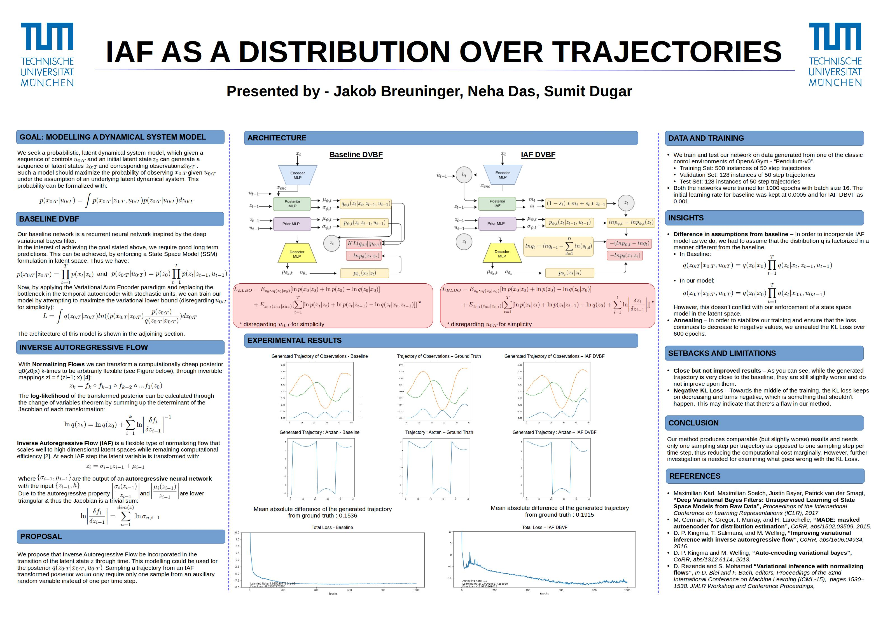

# IAF_Dynamics

Through this work, we propose the incorporation of Inverse Autoregressive Flows[4] in determining the state space (latents) in a dynamical system model. This reduces the number of samples that need to be obtained in order to approximate the posterior distribution (and thus the underlying states/latents for a set of observations and controls) from one per time step to one per sequence of observations. Our experiments with pendulum-v0[1], an environment from openai gym confirmed that the accuracy with which the observations are generated are close to the state of the art for sequence models.

The results from this work, along with its benefits and issues are present in the following poster (PDF version [here](Documents/Inserted_IAF_poster.pdf))

This work has been implemented in collaboration with [Jakob Breuninger](https://github.com/JakobBreuninger) and [Sumit Dugar](https://github.com/dugarsumit). 

References : 
1. [openai-gym-pendulum-v0](https://github.com/openai/gym/wiki/Pendulum-v0)
2. Maximilian Karl, Maximilian Soelch, Justin Bayer, Patrick van der Smagt, “Deep Variational Bayes Filters: Unsupervised Learning of State Space Models from Raw Data”, Proceedings of the International Conference on Learning Representations (ICLR), 2017
3. M. Germain, K. Gregor, I. Murray, and H. Larochelle, “MADE: masked autoencoder for distribution estimation”, CoRR, abs/1502.03509, 2015.
4. D. P. Kingma, T. Salimans, and M. Welling, “Improving variational inference with inverse autoregressive flow”, CoRR, abs/1606.04934, 2016.
5. D. P. Kingma and M. Welling, “Auto-encoding variational bayes”, CoRR, abs/1312.6114, 2013.
6. D. Rezende and S. Mohamed “Variational inference with normalizing flows”, In D. Blei and F. Bach, editors, Proceedings of the 32nd International Conference on Machine Learning (ICML-15), pages 1530–1538. JMLR Workshop and Conference Proceedings,
